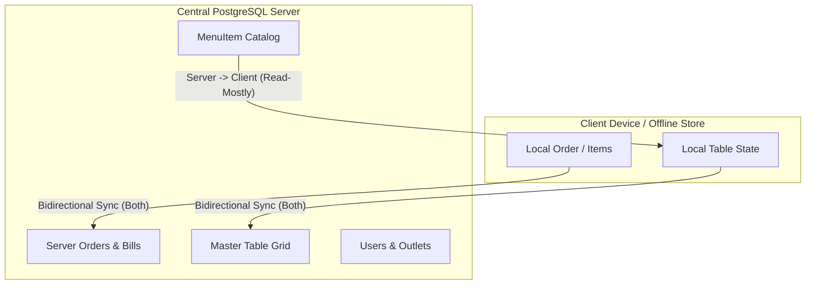

# NextBills POS - Current Architecture Audit

**Date**: September 13, 2026  
**Audit Type**: Read-Only Source Code Inspection  
**Target Repository**: `Om-coder2005/web_demo` (NextBills POS)

---

## 1. Executive Summary & Codebase Layout

This audit represents an empirical, line-by-line inspection of the current NextBills POS application. No claims in `working.md` or `README.md` were accepted without direct verification against source files.

### Repository Map

```
web_demo/
├── app/
│   ├── admin/             # Platform admin console (users & outlets allocation)
│   ├── admin-login/       # Hardcoded admin credentials login view
│   ├── dashboard/         # Franchise & Hotel Owner analytics & staff lists
│   ├── kitchen/           # Kitchen Display System (KDS) live order queue
│   ├── login/             # Dual mode: Staff OTP & POS Machine terminal login
│   ├── menu/              # Public/staff menu catalog viewer
│   ├── settings/          # Hotel Settings: Menu editor, Table Layout, Machine credentials
│   ├── signup/            # Public staff account registration form
│   ├── tables/            # Waiter POS floor layout & order taking interface
│   ├── unauthorized/      # RBAC access denial page
│   ├── api/               # Next.js Serverless API routes
│   │   ├── admin/         # /users & /outlets management APIs
│   │   ├── auth/          # /send-otp, /verify-otp, /machine-login, /admin-login, /signup, /logout, /session
│   │   ├── machine/       # /credentials, /heartbeat, /status APIs
│   │   ├── menu/          # /route.js (CRUD), /import, /export, /template
│   │   ├── orders/        # /route.js (GET, POST, PATCH - order creation, status, billing)
│   │   ├── outlets/       # /me, /settings
│   │   ├── realtime/      # SSE stream route (/api/realtime?hotelId=...)
│   │   └── tables/        # /route.js (GET, POST, PATCH - table grid management)
│   ├── globals.css        # Core styling tokens & CSS variables
│   ├── layout.js          # Root layout
│   └── page.js            # Landing homepage with Three.js hero animation
├── components/
│   ├── Hero3D.js              # Three.js 3D floating canvas animation
│   ├── KOTItemSummary.js      # Consolidated dish count banner on KDS
│   ├── MachineConnectivity.js # POS machine offline banner & 15s heartbeat hook
│   ├── Navbar.js              # Global top navigation & outlet switcher dropdown
│   └── OrderModal.js          # Waiter POS KOT modal & dish selection panel
├── lib/
│   ├── auth.js          # JWT signing (`jsonwebtoken`), cookie setting (`setSessionCookie`)
│   ├── db.js            # Prisma client singleton instance (`new PrismaClient()`)
│   ├── initialData.js   # Legacy hardcoded fallback mock arrays (Hotels, Staff, Menu, Tables, Orders)
│   ├── mailer.js        # Nodemailer Gmail transport for OTP delivery
│   ├── permissions.js   # Role permission helpers (`canManageFloor`, `canManageKitchen`)
│   ├── realtimeBus.js   # In-memory EventEmitter (`EventEmitter`) for SSE dispatch
│   ├── scope.js         # Session outlet resolver (`resolveOutletForSession`)
│   └── storage.js       # LocalStorage abstraction & legacy state synchronization
├── prisma/
│   ├── schema.prisma    # PostgreSQL database schema (9 models, 2 enums)
│   └── seed.js          # Database seeder script for Administrator account
├── proxy.js             # Middleware proxy handler for JWT validation & route protection
├── middleware.js        # Next.js middleware bridge routing to proxy.js
├── .env                 # Environment variables (Neon PostgreSQL, Gmail, JWT secret)
├── next.config.mjs      # Next.js configuration
├── working.md           # Previous system documentation artifact
└── package.json         # Dependencies & scripts
```

### Dead / Unused Code & Package Dependencies Analysis

During source code inspection, the following unused packages and dead code files were discovered:

1. **Unused / Dead Package Dependencies (`package.json`)**:
   - `idb` (`^8.0.3`): Installed in `package.json`, but **zero references** exist anywhere in the codebase. IndexedDB is not used.
   - `socket.io` (`^4.8.3`) & `socket.io-client` (`^4.8.3`): Installed in `package.json`, but **zero references** exist in application code. Realtime is driven entirely by SSE (`/api/realtime`) and Node `EventEmitter`.
   - `next-auth` (`^5.0.0-beta.32`): Installed in `package.json`, but **zero references** exist in application code. Auth uses custom JWT cookies (`jsonwebtoken` / `jose`).
2. **Dead / Orphanded Data Files**:
   - `menu_data.js` & `excel_menu.json`: Standalone hardcoded JSON/JS arrays in the project root; imported only by `lib/initialData.js` as fallback defaults.
   - `lib/initialData.js`: Contains `INITIAL_HOTELS`, `INITIAL_STAFF`, `INITIAL_TABLES`, `INITIAL_ORDERS`, `INITIAL_HISTORICAL_ORDERS`. Used strictly by `lib/storage.js` when LocalStorage keys are uninitialized.

---

## 2. Business Workflow Code Paths

### A. Login Workflow
- **UI**: `app/login/page.js` or `app/admin-login/page.js`
- **React State**: `email`, `otp`, `password`, `mode` (`staff` | `machine`), `busy`, `error`
- **API Client**: `fetch("/api/auth/send-otp")` -> `fetch("/api/auth/verify-otp")` or `fetch("/api/auth/machine-login")`
- **Server Route**: `app/api/auth/send-otp/route.js` -> `app/api/auth/verify-otp/route.js`
- **Validation**: Email regex, OTP code lookup in `OtpSession` table (`expiresAt >= now()`, `verified: false`).
- **Prisma**: `prisma.user.findUnique()`, `prisma.otpSession.create()`, `prisma.otpSession.update()`
- **PostgreSQL**: `User` table read, `OtpSession` table insert/update.
- **Session Dispatch**: Creates JWT via `createToken()` in `lib/auth.js` and sets `khandoli_session` HTTP-only cookie. Writes user JSON to LocalStorage via `setCurrentUser()`.

### B. Table Loading Workflow
- **UI**: `app/tables/page.js`
- **React State**: `tables`, `orders`, `menu`, `outlet`
- **API Client**: `fetch("/api/tables")`, `fetch("/api/orders")`, `fetch("/api/menu")`
- **Server Route**: `app/api/tables/route.js`, `app/api/orders/route.js`, `app/api/menu/route.js`
- **Validation**: `resolveOutletForSession(session, hotelId)`
- **Prisma**: `prisma.table.findMany()`, `prisma.order.findMany()`, `prisma.menuItem.findMany()`
- **PostgreSQL**: Queries `Table`, `Order` (where `status: preparing` | `done`), `MenuItem` (where `available: true`).

### C. Creating / Dispatching KOT Order Workflow
- **UI**: `components/OrderModal.js`
- **React State**: `currentItems` array, `notes` string
- **API Client**: `fetch("/api/orders", { method: "POST", body: { tableNumber, items, notes } })`
- **Server Route**: `app/api/orders/route.js` (POST)
- **Validation**: `canManageFloor(session.role)` check; menu item IDs validated against outlet `MenuItem` table; quantities parsed as positive integers.
- **Prisma**: Executed inside `$transaction`:
  1. `tx.order.create()` inserting `Order` and nested `OrderItem` records.
  2. `tx.table.updateMany()` marking table status as `"Occupied"` and linking `currentOrderId`.
- **PostgreSQL**: Insert into `Order` & `OrderItem` tables; UPDATE `Table`.
- **Realtime Trigger**: Calls `emitOutletEvent(outlet.id, "orders:create", { orderId })` which broadcasts SSE event to connected clients.

### D. Kitchen Display (KDS) & Item Status Changes
- **UI**: `app/kitchen/page.js`
- **React State**: `orders`, `history`, `animatingDoneOrders`
- **API Client**: `fetch("/api/orders", { method: "PATCH", body: { action: "item-status" | "mark-done", orderId, itemId } })`
- **Server Route**: `app/api/orders/route.js` (PATCH)
- **Validation**: `canManageKitchen(session.role)` check.
- **Prisma**: `prisma.orderItem.update()`, evaluates whether all items on order are `"done"`, then `prisma.order.update()` updating `status` to `"done"` and `completedAt: new Date()`.
- **PostgreSQL**: UPDATE on `OrderItem` and `Order`.
- **Realtime Trigger**: `emitOutletEvent(outlet.id, "orders:update", { orderId })`.

### E. Billing & Completion Workflow
- **UI**: `app/tables/page.js` via `OrderModal.js`
- **React State**: `activeModalOrder`
- **API Client**: `fetch("/api/orders", { method: "PATCH", body: { orderId, action: "bill" } })`
- **Server Route**: `app/api/orders/route.js` (PATCH)
- **Validation**: `canManageFloor(session.role)` check.
- **Prisma**: Executed inside `$transaction`:
  1. Queries highest `billNumber` for outlet: `prisma.order.findFirst({ where: { outletId, billNumber: { not: null } }, orderBy: { billNumber: "desc" } })`.
  2. Increments `billNumber = lastBill + 1`.
  3. `tx.order.update()` setting `status: "billed"`, `billNumber`, `billedAt: new Date()`.
  4. `tx.table.updateMany()` resetting table status to `"Available"` and `currentOrderId: null`.
- **PostgreSQL**: Max aggregate lookup on `Order`, UPDATE `Order`, UPDATE `Table`.
- **Realtime Trigger**: `emitOutletEvent(outlet.id, "orders:billed", { orderId, billNumber })`.

### F. Table Grid Management Workflow
- **UI**: `app/settings/page.js` -> `app/tables/page.js`
- **React State**: `count`, `capacity`, `section`
- **API Client**: `fetch("/api/tables", { method: "POST", body: { count, capacity, section } })`
- **Server Route**: `app/api/tables/route.js` (POST)
- **Validation**: `session.role === "hotel_owner"` enforcement; count bounded between 1 and 200.
- **Prisma**: Executed inside `$transaction`:
  1. `prisma.table.deleteMany({ where: { outletId } })`
  2. `prisma.table.createMany()` regenerating tables `T1` through `T{count}`.
- **PostgreSQL**: DELETE all outlet tables, batch INSERT new tables.
- **Realtime Trigger**: `emitOutletEvent(outlet.id, "tables:reset", { count })`.

---

## 3. Persistence Inventory & Classification

Every occurrence of persistence across the codebase was searched and classified:

| Persistence Location | Mechanism | Data Stored | Classification | Verification Notes |
| :--- | :--- | :--- | :--- | :--- |
| `lib/storage.js` (L18-34) | `localStorage` | `pos_hotels_data`, `pos_staff_data`, `pos_menu_data`, `pos_tables_data`, `pos_orders_data`, `pos_history_orders_data` | **LEGACY / MOCK** | **DIVERGENCE FOUND**: `lib/storage.js` still populates LocalStorage with fallback mock arrays if keys are missing. `app/kitchen/page.js` and `app/dashboard/page.js` still read from `lib/storage.js` instead of DB APIs! |
| `lib/storage.js` (L36-64) | `localStorage` | `pos_current_user`, `pos_selected_hotel` | **SESSION STATE / CACHE** | Stores decoded active user session & selected hotel object for fast client-side navbar rendering. |
| `proxy.js` / `lib/auth.js` | HTTP Cookie | `khandoli_session` | **REAL PRODUCTION DATA** | JWT session token used by middleware and API routes for RBAC and scope resolution. |
| `app/tables/page.js` | React State | `tables`, `orders`, `menu` | **CACHE** | Fetched from `/api/tables`, `/api/orders`, `/api/menu` on mount and refreshed via SSE events. |
| `app/kitchen/page.js` | React State | `orders`, `history` | **LEGACY CACHE** | Populated via `getOrders()` and `getHistoryOrders()` from `lib/storage.js`. **Needs full migration to DB API**. |
| `app/dashboard/page.js` | React State | `hotels`, `staff`, `orders` | **LEGACY CACHE** | Reads from `lib/storage.js`. **Needs full migration to DB API**. |
| `components/OrderModal.js` | React State | `currentItems`, `notes`, `mobileTab` | **SESSION STATE** | In-memory draft order state while waiter builds KOT. Cleared on close or submission. |
| `prisma/schema.prisma` | PostgreSQL | All 9 DB tables | **REAL PRODUCTION DATA** | Authoritative data store for neon PostgreSQL database. |

---

## 4. Database Schema Audit (`prisma/schema.prisma`)

| Model | Primary Key | Foreign Keys | Unique Constraints | Indexes | Nullable Fields | Timestamps | Enums | Delete Behavior | Offline Sync Suitability |
| :--- | :--- | :--- | :--- | :--- | :--- | :--- | :--- | :--- | :--- |
| **`Outlet`** | `id` (cuid) | `franchiseOwnerId` -> `User.id` | `hotelId`, `slug` | None | `phone`, `billNote`, `kotNote`, `franchiseOwnerId` | `createdAt` | None | Restrict | **YES** (Read-Mostly) |
| **`User`** | `id` (cuid) | `outletId` -> `Outlet.id` | `email` | None | `outletId` | `createdAt`, `updatedAt` | `UserRole` | Restrict | **PARTIAL** (Device/Session) |
| **`OtpSession`** | `id` (cuid) | None | None | `[email]` | None | `createdAt` | None | N/A | **NO** (Server-only security) |
| **`MachineCredential`**| `id` (cuid)| `outletId` -> `Outlet.id` | `outletId`, `machineEmail`, `apiToken` | None | `lastHeartbeat` | `createdAt`, `updatedAt` | None | Cascade | **NO** (Device Security) |
| **`MenuItem`** | `id` (cuid) | `outletId` -> `Outlet.id` | None | `[outletId]` | `description`, `kitchenNote`, `billNote` | None | None | Restrict | **YES** (Read-Mostly Config) |
| **`StockLog`** | `id` (cuid) | `menuItemId` -> `MenuItem.id`, `updatedBy` -> `User.id` | None | None | None | `createdAt` | None | Restrict | **YES** (Transactional Log) |
| **`Table`** | `id` (cuid) | `outletId` -> `Outlet.id` | `[outletId, number]` | `[outletId]` | `label`, `section`, `currentOrderId` | None | None | Cascade | **YES** (State Sync) |
| **`Order`** | `id` (cuid) | `outletId` -> `Outlet.id` | None | `[outletId, status]`, `[outletId, tableNumber]` | `billNumber`, `notes`, `completedAt`, `billedAt` | `createdAt`, `updatedAt` | `OrderStatus` | Restrict | **CRITICAL SYNC ENTITY** |
| **`OrderItem`** | `id` (cuid) | `orderId` -> `Order.id`, `menuItemId` -> `MenuItem.id` | None | `[orderId]` | None | None | None | Cascade on Order delete | **CRITICAL SYNC ENTITY** |
| **`BillAuditLog`** | `id` (cuid) | `orderId` -> `Order.id`, `modifiedById` -> `User.id` | None | `[orderId]` | None | `createdAt` | None | Restrict | **YES** (Audit Trail) |

---

## 5. Database Transaction Analysis

The codebase contains 4 explicit `prisma.$transaction` blocks:

1. **Order Creation (`app/api/orders/route.js` L65-79)**:
   - **Operations**: `tx.order.create()` (with nested `OrderItem.create`), followed by `tx.table.updateMany()`.
   - **ID Strategy**: Client does NOT provide order ID; CUID is generated by server/Prisma (`cuid()`).
   - **Race Condition Risk**: High if offline retries submit duplicate requests without client-side Idempotency Keys or UUIDs.

2. **Order Completion (`app/api/orders/route.js` L104-107)**:
   - **Operations**: `tx.orderItem.updateMany()` setting status to `"done"`, followed by `tx.order.update()` setting status to `"done"` and `completedAt`.
   - **Atomic Operation**: Safe against partial status updates.

3. **Billing Order & Releasing Table (`app/api/orders/route.js` L116-120)**:
   - **Operations**: `tx.order.update()` setting status `"billed"`, assigning `billNumber`, followed by `tx.table.updateMany()` resetting table status to `"Available"`.
   - **Bill Number Generation**: Reads highest `billNumber` via `findFirst` BEFORE opening transaction, then adds 1.
   - **CRITICAL RACE CONDITION**: Concurrent billing requests at the same outlet can result in **duplicate bill numbers**!

4. **Table Grid Regeneration (`app/api/tables/route.js` L37-48)**:
   - **Operations**: `prisma.table.deleteMany()`, followed by `prisma.table.createMany()`.
   - **Destructive Operation**: Deletes all table records for the outlet and recreates them with 1..N indices. If executed while offline orders reference old table IDs, foreign key references or table matching will break.

---

## 6. Offline Risk Analysis

| Operation | Current Persistence | Network Required | Offline Safe | Risk / Failure Mode |
| :--- | :--- | :--- | :--- | :--- |
| **User Sign-In (OTP)** | Server DB (`OtpSession`) | YES | **NO** | Cannot receive or verify OTP without connection to Neon DB and Gmail SMTP server. |
| **Machine Sign-In** | Server DB (`MachineCredential`)| YES | **NO** | `bcrypt.compare` against PostgreSQL record requires network. |
| **Load Floor Tables** | React state / Server API | YES | **NO** | `/api/tables` fetch fails if network is down. |
| **View KDS Kitchen Queue**| React state / LocalStorage | PARTIALLY | **NO** | Uses LocalStorage fallback if API fails, causing **data divergence** from actual DB. |
| **Create KOT Order** | React state -> POST API | YES | **NO** | POST to `/api/orders` fails immediately on connection drop. Draft is lost unless held in modal. |
| **Mark Dish / Order Done**| React state -> PATCH API | YES | **NO** | Kitchen status updates fail without connection; SSE broadcast fails. |
| **Generate Sales Bill** | React state -> PATCH API | YES | **NO** | Sequential bill number calculation and table release require server transaction. |
| **Edit Menu / Stock** | React state -> PATCH API | YES | **NO** | Menu changes require direct server write. |
| **Realtime Updates** | SSE (`/api/realtime`) | YES | **NO** | SSE stream disconnects; client misses order creation/billing events with zero replay log. |

---

## 7. Sync Candidate Entities Classification



1. **READ-MOSTLY CONFIGURATION (Server -> Client)**:
   - `Outlet`, `MenuItem`
   - *Sync Need*: Downloaded on connect/sync; cached locally for menu browsing and dish price lookup offline.
2. **TRANSACTIONAL (Bidirectional / Both)**:
   - `Table`, `Order`, `OrderItem`
   - *Sync Need*: Must be created/updated locally while offline and synced to server seamlessly when connection restores.
3. **AUDIT (Client -> Server)**:
   - `StockLog`, `BillAuditLog`
   - *Sync Need*: Pushed from client to server upon bill editing or stock adjustments.
4. **DEVICE / SESSION (No Offline Sync)**:
   - `OtpSession`, `MachineCredential`
   - *Sync Need*: Server-only security primitives.
5. **REPORTING (Server Aggregation)**:
   - Franchise analytics & daily revenue totals. Calculated server-side across outlets.

---

## 8. Identity & Key Generation Analysis

- **Current Primary Key Strategy**: All schema models use CUID (`@default(cuid())`).
- **CUID Offline Evaluation**: Standard CUID generation in Prisma relies on node environment / server process state. While CUID can be generated on clients, switching to **UUID v4** (`crypto.randomUUID()`) for `Order`, `OrderItem`, `Table`, `StockLog`, and `BillAuditLog` is strongly recommended for local-first creation to guarantee zero collisions.
- **Sequential Bill Number Strategy**: Currently calculated as `(max(billNumber) for outlet) + 1` server-side during billing.
- **OFFLINE BILL NUMBER RISK**: If multiple offline terminals generate bills independently, offline sequential bill numbers WILL conflict upon sync. Bill generation requires an offline-safe strategy (e.g. prefixing terminal ID `OUTLET1-TERMA-1001` or server-assigned sequential ranges).

---

## 9. Real-Time Architecture Audit

- **Implementation**: `lib/realtimeBus.js` uses Node `EventEmitter` instance stored on `globalThis.__khandoliRealtimeBus`.
- **Stream Route**: `app/api/realtime/route.js` streams Server-Sent Events (`text/event-stream`).
- **Event Types**:
  - `connected`: Emitted upon SSE handshake.
  - `heartbeat`: Emitted every 25 seconds.
  - `orders:create`: Emitted when new KOT order is posted.
  - `orders:update`: Emitted when kitchen updates item/order status.
  - `orders:billed`: Emitted when order is billed.
  - `tables:update` / `tables:reset`: Emitted when table grid changes.
  - `outlet:settings`: Emitted when custom notes update.
- **Architectural Vulnerabilities**:
  1. **In-Memory Single Instance Limitation**: Because `EventEmitter` lives in Node process memory, real-time events **will fail** if Next.js is deployed across multiple serverless instances/workers or Vercel functions!
  2. **No Message Persistence / Replay**: If a client temporarily drops network for 5 seconds and reconnects, missed SSE events are permanently lost.
  3. **Real-time + Offline Coexistence**: When offline synchronization (e.g. PowerSync or local database sync) is introduced, the local database sync engine handles data persistence, while SSE/WebSocket continues to serve as an instant notification trigger for UI re-rendering.

---

## 10. Printing Architecture Audit

- **Current Status**: Source code inspection revealed **zero explicit printing code** or `window.print()` calls in the codebase.
- **Receipt Rendering**: Bills are rendered as HTML React modal components (`OrderModal.js`).
- **Offline Printing Requirement**: For an offline-first POS, printing must execute locally from client memory or local browser print dialog directly to USB/Thermal printers connected to the local network or terminal machine, independent of server availability.

---

## 11. Authentication & RBAC Audit

- **JWT Session Tokens**: Signed via `jsonwebtoken` in `lib/auth.js` (`createToken()`) with payload: `{ userId, email, name, role, outletId, hotelId, outletName }`.
- **Middleware Boundary**: `proxy.js` intercepts routes `/dashboard`, `/tables`, `/kitchen`, `/menu`, `/settings`, `/admin`, verifying JWT signature via `jose` `jwtVerify`.
- **Role Enforcement**:
  - `admin`: `/admin` console only.
  - `franchise_owner`: Multi-outlet dashboard.
  - `hotel_owner`: Single outlet management (Settings, Tables, Kitchen, Menu).
  - `waiter` & `machine`: Floor tables, KOT creation, billing.
  - `kitchen`: KDS display and dish status updates.
- **Offline Auth Requirement**: To support offline operation, once a JWT is issued and validated online, the session token and user role profile must be cached securely in client storage so local authorization checks (`canManageFloor`, `canManageKitchen`) function without server pings.

---

## 12. Environment Variables Inventory

| Variable Name | Required / Optional | Scope | Current Purpose |
| :--- | :--- | :--- | :--- |
| `DATABASE_URL` | **Required** | Server | Connection string for Neon PostgreSQL database. |
| `NEXTAUTH_SECRET` | **Required** | Server | Secret key used for signing JWT cookies (`jsonwebtoken` & `jose`). |
| `GMAIL_USER` | Optional (Dev) | Server | Gmail address for sending OTP verification emails via Nodemailer. |
| `GMAIL_APP_PASSWORD` | Optional (Dev) | Server | Gmail App Password for SMTP authentication. |
| `NEXTAUTH_URL` | Optional | Server | Canonical app URL (`http://localhost:3000`). |
| `NEXT_PUBLIC_WS_URL`| Optional | Client | Configured for WebSocket URL (`ws://localhost:3000`), currently unused. |
| `POS_MACHINE_API_KEY`| Optional | Server | Fallback API key for POS Machine authentication. |

*Note: All secret values are safely managed and excluded from documentation logs.*

---

## 13. File Change Boundaries for Future Offline Integration

### A. SHOULD NOT CHANGE (Core Domain Models & Auth Logic)
- `prisma/schema.prisma` (Core entity names, relationships, and business roles should remain stable).
- `lib/auth.js` & `proxy.js` (JWT cookie validation & security boundaries).
- `lib/permissions.js` (Role permission helpers).
- `app/api/auth/*` (Server-side OTP generation and user registration APIs).

### B. WILL PROBABLY CHANGE (Data Access & API Interfaces)
- `app/tables/page.js` & `components/OrderModal.js` (Switching from direct `fetch('/api/orders')` to local repository / offline store).
- `app/kitchen/page.js` (Removing `lib/storage.js` LocalStorage calls, binding to real-time local database query).
- `app/dashboard/page.js` (Refactoring staff & revenue statistics to query local store / API).
- `app/api/orders/route.js` (Updating order creation to accept client-generated UUIDs and handling idempotency).

### C. NEEDS ARCHITECTURAL REVIEW
- `lib/storage.js` (Must be completely deprecated or refactored into a local IndexedDB/SQLite repository layer).
- `lib/realtimeBus.js` & `/api/realtime` (Integrating local sync engine events alongside SSE triggers).
- Bill Numbering Strategy in `app/api/orders/route.js` (Redesigning sequential bill numbers to avoid offline collision).

---

## 14. Critical Findings & Vulnerabilities Summary

### 🚨 CRITICAL
1. **Kitchen & Dashboard LocalStorage Divergence**: `app/kitchen/page.js` and `app/dashboard/page.js` currently import and read from `lib/storage.js` (LocalStorage mock data) instead of querying database API routes. This creates immediate data inconsistency between waiter orders and kitchen displays.
2. **Offline Vulnerability (0% Offline Functionality)**: Every primary POS operation (table loading, KOT order creation, item status changes, billing) requires a live synchronous HTTP connection to Neon PostgreSQL. Disconnecting network breaks all functionality.

### ⚠️ HIGH
3. **Bill Number Race Condition**: Sequential `billNumber` generation in `app/api/orders/route.js` fetches `max(billNumber)` before starting a transaction, creating duplicate bill numbers under concurrent requests.
4. **Destructive Table Grid Regeneration**: `POST /api/tables` executes `deleteMany()` on all outlet tables before recreating them, breaking foreign keys or active order associations if executed during active operations.

### 🟡 MEDIUM
5. **Single-Instance In-Memory SSE Bus**: `lib/realtimeBus.js` relies on Node `EventEmitter` in memory. If scaled across multiple serverless processes, real-time events will not cross instance boundaries.
6. **Unused Installed Dependencies**: `idb`, `socket.io`, `socket.io-client`, and `next-auth` exist in `package.json` without usage in application code.

---

*Document compiled for NextBills POS Architectural Repository Audit.*
