# NextBills POS - Incremental Migration Sequence

**Date**: September 13, 2026  
**Status**: Architectural Specification (Design Only)  
**Target Repository**: `Om-coder2005/web_demo` (NextBills POS)

---

## 1. Migration Strategy & Principles

The migration of NextBills POS from a synchronous server-dependent application to an offline-first architecture must be executed **incrementally**.

### Core Safety Rules
1. **Zero Downtime**: The existing application must remain operational and fully functional after every phase.
2. **Backward Compatibility**: Existing database tables, server routes, and auth mechanisms must continue to support legacy web clients during rollout.
3. **No Big Bang Deployment**: Offline capabilities will be introduced feature-by-feature (Order Creation $\rightarrow$ KDS $\rightarrow$ Billing $\rightarrow$ Tables).

---

## 2. Phase-by-Phase Execution Roadmap

```mermaid
flowchart LR
    P0[Phase 0: Baseline & Code Cleanup] --> P1[Phase 1: DB & API Hardening]
    P1 --> P2[Phase 2: Local Repository Abstraction]
    P2 --> P3[Phase 3: Order & KOT Local-First]
    P3 --> P4[Phase 4: Kitchen KDS Local Sync]
    P4 --> P5[Phase 5: Offline Billing & Printing]
    P5 --> P6[Phase 6: Table Grid Sync]
    P6 --> P7[Phase 7: Full PowerSync Engine]
    P7 --> P8[Phase 8: Offline Stress Validation]
```

### Phase 0: Baseline Audit & Codebase Cleanup
- **Goal**: Resolve immediate codebase inconsistencies.
- **Tasks**:
  - Remove legacy LocalStorage mock array calls (`lib/storage.js`) from `app/kitchen/page.js` and `app/dashboard/page.js`.
  - Ensure all pages read strictly from server database API routes.
- **Verification**: Run E2E browser tests to confirm Kitchen and Dashboard display real database records.
- **Rollback Safety**: Low risk; pure bug fix.

### Phase 1: Database & API Hardening
- **Goal**: Prepare server APIs for offline batch ingestion and idempotency.
- **Tasks**:
  - Update `prisma/schema.prisma` to add `@unique` `clientOrderKey` to `Order`.
  - Refactor `POST /api/orders` to accept client-generated UUIDs and enforce idempotency.
  - Refactor `POST /api/tables` from destructive `deleteMany()` to non-destructive upserts.
- **Verification**: Post duplicate order creation requests to `/api/orders` and verify `200 OK` returns existing order without creating duplicates.
- **Rollback Safety**: Non-breaking; API handles both server-generated CUIDs and client UUIDs.

### Phase 2: Local Repository Abstraction
- **Goal**: Abstract UI data access behind a unified Repository pattern.
- **Tasks**:
  - Implement `OrderRepository`, `TableRepository`, and `MenuRepository` in `lib/repositories/`.
  - In online mode, repositories delegate to standard `fetch('/api/*')`.
- **Verification**: Validate that UI components render cleanly through the Repository interface.
- **Rollback Safety**: Zero risk; pure refactoring.

### Phase 3: Local-First KOT Order Creation
- **Goal**: Enable waiters to create and save orders locally while offline.
- **Tasks**:
  - Integrate client-side storage (IndexedDB / SQLite WASM) into `OrderRepository`.
  - `OrderModal.js` writes order payload directly to local store with UUIDs and enqueues sync task.
- **Verification**: Disconnect internet, click **Send to Kitchen**, verify order saves to local store and table status updates to `"Occupied"`.
- **Rollback Safety**: If local store fails, repository falls back to direct API POST.

### Phase 4: Offline Kitchen Display System (KDS)
- **Goal**: Ensure Kitchen Display renders active KOTs locally without internet.
- **Tasks**:
  - Update `app/kitchen/page.js` to subscribe to local reactive order store.
  - Chef item status changes (`done` / `preparing`) update local store immediately.
- **Verification**: Place order on Waiter device offline $\rightarrow$ Verify KDS display updates ticket immediately on local network.
- **Rollback Safety**: KDS can toggle back to server polling if local store fails.

### Phase 5: Offline Billing & Printing
- **Goal**: Allow terminal billing and receipt printing without server connection.
- **Tasks**:
  - Implement terminal-prefixed bill numbering (`B-OUT1-T1-1001`) in local repository.
  - Enable receipt modal printing directly from local React state.
- **Verification**: Mark order billed offline; verify receipt prints cleanly and table releases locally.
- **Rollback Safety**: Billed orders sync to server upon reconnection.

### Phase 6: Offline Table Grid Synchronization
- **Goal**: Support table layout edits and table status state sync.
- **Tasks**:
  - Bind `app/tables/page.js` to local table state.
  - Sync table status changes (`Available` $\leftrightarrow$ `Occupied` $\leftrightarrow$ `Billed`) via background sync queue.
- **Verification**: Test table status transitions on multiple offline terminals.

### Phase 7: PowerSync Engine Integration
- **Goal**: Connect local SQLite database to PowerSync sync gateway.
- **Tasks**:
  - Configure PowerSync client SDK and sync rules.
  - Connect client database sync stream to Next.js backend `/api/sync/upload`.
- **Verification**: Test continuous sync streaming and automatic delta catch-up upon reconnection.

### Phase 8: Offline Failure & Stress Verification
- **Goal**: Rigorous validation under extreme network degradation.
- **Test Scenarios**:
  - 100 consecutive KOT orders submitted while offline $\rightarrow$ Reconnect $\rightarrow$ Verify zero missing orders or duplicates in PostgreSQL.
  - Simultaneous offline billing on 2 separate terminals $\rightarrow$ Verify zero bill number conflicts.
  - Mid-transaction network drop during KOT dispatch $\rightarrow$ Verify queue retries safely upon reconnect.

---

## 3. Rollback & Contingency Plan

If an unexpected issue occurs during any migration phase:
1. **Repository Fallback**: The local repository layer contains a feature flag (`ENABLE_OFFLINE_MODE=false`). Setting this flag instantly routes all data calls back to standard Next.js HTTP API endpoints.
2. **Database Integrity**: PostgreSQL remains the single source of truth throughout all phases. No data is purged from PostgreSQL during migration.

---

*Document compiled for NextBills POS Incremental Migration Sequence.*
