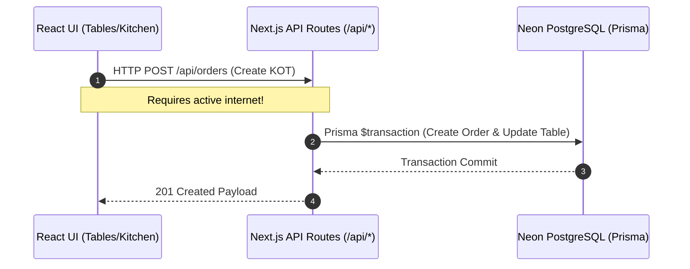
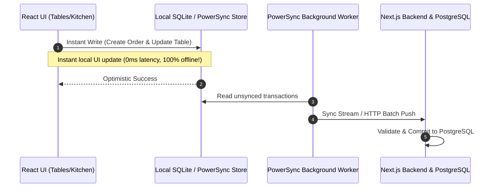
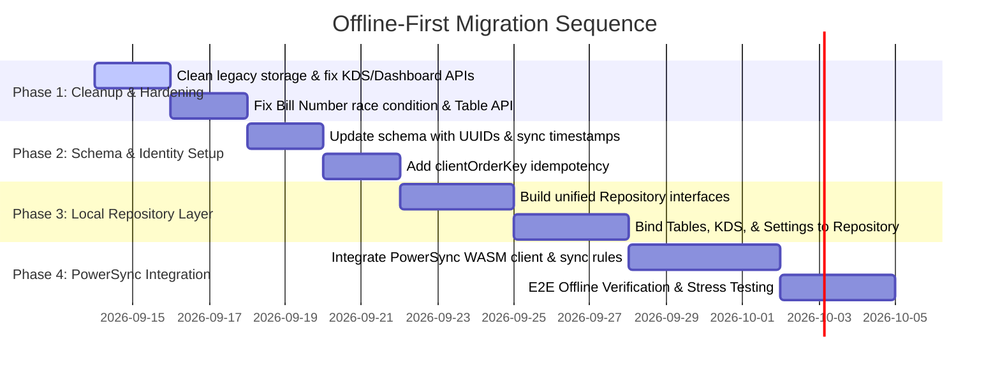

# NextBills POS - Offline Integration Gap Analysis

**Date**: September 13, 2026  
**Target Architecture**: Local-First / Offline-Capable Point of Sale  
**Reference Audit**: `docs/architecture/CURRENT_ARCHITECTURE_AUDIT.md`

---

## 1. Executive Summary

This document answers the core architectural question:  
> **"What must change to make this exact NextBills POS offline-first without changing its current functionality or user experience?"**

Currently, NextBills POS relies entirely on a **Client -> HTTP API -> Server Prisma -> PostgreSQL** architecture. Any network interruption to Neon PostgreSQL halts floor table operations, KOT dispatch, kitchen display updates, and bill generation.

To transform NextBills POS into an enterprise-grade, offline-first application, we must transition to a **Client -> Local Store / Sync Engine -> Remote PostgreSQL** model.

---

## 2. Current vs. Target Architecture

### Current Synchronous Architecture

### Target Local-First Offline-Capable Architecture

---

## 3. Comprehensive Gap Analysis Matrix

| System Area | Current Behavior | Required Offline-First Behavior | Gap / Required Change |
| :--- | :--- | :--- | :--- |
| **Data Persistence** | Direct HTTP fetch to `/api/*` + Prisma PostgreSQL. | Local SQLite database embedded in browser client (e.g. via PowerSync / WASM). | Implement local repository layer interfacing with local database. |
| **Order ID Generation** | Server generates CUID (`cuid()`) on `prisma.order.create()`. | Client generates UUID v4 locally (`crypto.randomUUID()`) prior to sync. | Update Order creation logic to accept client-provided UUIDs. |
| **Bill Numbering** | `max(billNumber) + 1` calculated in server transaction. | Terminal-scoped or range-based bill number generation offline. | Introduce terminal prefixing (e.g. `OUTLET1-T1-1001`) or reserved server blocks. |
| **Kitchen Sync (KDS)**| `app/kitchen/page.js` reads LocalStorage mock arrays! | Reads directly from active local database sync stream. | Deprecate `lib/storage.js` mock calls in KDS; bind to local reactive query. |
| **Table Layout Edits** | `deleteMany()` + `createMany()` destructive reset. | Non-destructive table upserts or soft deletion. | Update `/api/tables` POST to preserve existing table IDs during reconfiguration. |
| **Realtime Notifications**| In-memory SSE stream via `lib/realtimeBus.js`. | Local database reactive subscriptions + SSE fallback. | Combine local database reactive hooks with SSE triggers for seamless UI updates. |
| **Authentication** | Server-side JWT cookie validation on every route. | Cached JWT session token and role claims stored locally on login. | Store verified session token locally to allow offline RBAC checks (`canManageFloor`). |
| **Printing** | React modal HTML display. | Local client-side browser print / thermal printer integration. | Ensure bill and KOT print formats trigger directly from local React state. |

---

## 4. Required Database Changes

To support seamless multi-client offline synchronization without conflicts, the PostgreSQL schema (`prisma/schema.prisma`) requires the following non-breaking enhancements:

1. **Client ID Support**:
   - Ensure `id` fields across `Order`, `OrderItem`, `Table`, `StockLog`, and `BillAuditLog` support client-generated UUID strings (`@default(uuid())`).
2. **Soft Deletes & Sync Timestamps**:
   - Add `deletedAt DateTime?` to `Table` and `MenuItem` so deletions sync cleanly across offline devices without violating foreign key constraints.
   - Ensure all syncable models include `@updatedAt` timestamps for Last-Write-Wins conflict resolution.
3. **Terminal Identity on Orders**:
   - Add `terminalId String?` and `clientOrderKey String? @unique` to `Order` to prevent duplicate submissions when retrying sync batches.

---

## 5. Required API & Backend Changes

1. **Idempotent Order Ingestion (`POST /api/orders`)**:
   - Update POST handler to accept pre-generated `id` and `clientOrderKey`.
   - If an order with `clientOrderKey` already exists, return existing record instead of creating a duplicate.
2. **Non-Destructive Table Management (`POST /api/tables`)**:
   - Replace `deleteMany()` + `createMany()` with upsert logic based on `(outletId, number)` to maintain ID stability for offline clients.
3. **Bill Number Allocation**:
   - Support terminal-prefixed bill numbers or server-side sync adjustment to prevent offline collision.

---

## 6. Required Frontend & UI Changes

1. **Local Repository Layer**:
   - Abstract data calls behind a unified Repository interface (`OrderRepository`, `TableRepository`, `MenuRepository`).
   - Component pages (`app/tables/page.js`, `app/kitchen/page.js`) query the Repository instead of calling `fetch('/api/*')` directly.
2. **Complete Deprecation of `lib/storage.js`**:
   - Purge legacy fallback mock initialization (`INITIAL_HOTELS`, `INITIAL_STAFF`, `INITIAL_TABLES`, `INITIAL_ORDERS`) from `app/kitchen/page.js` and `app/dashboard/page.js`.
3. **Offline Status & Sync Queue Indicators**:
   - Add a subtle status indicator in `Navbar.js` displaying Connection Status (`Online` / `Offline`) and Pending Sync Queue count.

---

## 7. Strategic Migration Sequence

### Phase 1: Codebase Cleanup & API Normalization (No breaking changes)
- Remove `lib/storage.js` mock reads from `app/kitchen/page.js` and `app/dashboard/page.js`. Ensure 100% reliance on DB routes.
- Fix sequential bill number transaction handling in `app/api/orders/route.js`.

### Phase 2: Identity & Schema Hardening
- Add client-generated UUIDs and `clientOrderKey` idempotency checks to Prisma schema.
- Update table management API to use upsert instead of destructive `deleteMany`.

### Phase 3: Frontend Repository Abstraction
- Create local repository interface wrapping client database operations.
- Update UI components (`app/tables/page.js`, `components/OrderModal.js`, `app/kitchen/page.js`) to read/write through the repository layer.

### Phase 4: PowerSync & Offline Engine Integration
- Embed local SQLite WASM engine and PowerSync SDK.
- Configure client-side sync rules and connector APIs.
- Validate end-to-end offline order taking, KOT rendering, and automatic background reconnection sync.

---

*Document compiled for NextBills POS Offline Integration Gap Analysis.*
