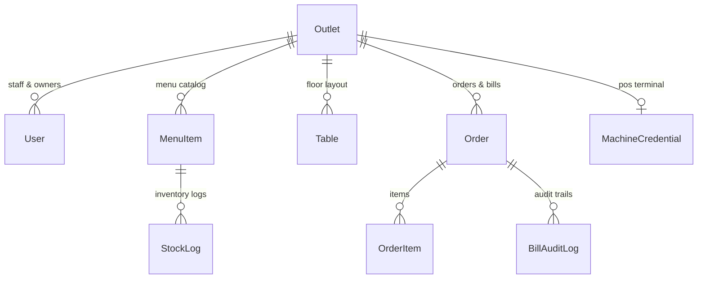

# NextBills POS - Architecture & Developer Guide

Welcome to the **NextBills POS** codebase documentation. This document is written for co-workers, system maintainers, and future AI agents to understand the system architecture, data models, real-time sync mechanisms, permissions, and operational workflows.

---

## 1. Executive Summary & Core Philosophy

**NextBills POS** is a high-performance, real-time Point of Sale and Kitchen Display System designed specifically for restaurant chains and hotel outlets.

### Principles:
1. **Zero Mock/False Data**: Every view in the application strictly reflects live PostgreSQL database records. When a new hotel is onboarded, it starts completely clean with zero items, zero tables, zero staff, and zero orders until configured by the Hotel Owner.
2. **Real-Time Synchronization**: Built with a Socket.io event bus enabling instant bidirectional communication between server and clients for floor waiters, kitchen displays, and terminal machines with zero page refreshes.
3. **Role-Based Access Control (RBAC)**: Strict server-enforced boundary across 6 explicit roles: `admin`, `franchise_owner`, `hotel_owner`, `machine`, `waiter`, and `kitchen`.
4. **Auditability & POS Integrity**: Every bill generated receives a sequential bill number per hotel. Any bill adjustments produce an immutable `BillAuditLog` record containing a diff of item changes, user id, and reason.

---

## 2. Technical Stack

- **Framework: Next.js 1. Next.js 16 (App Router with Turbopack)  
Database & ORM: PostgreSQL via Prisma 6 ORM  
Real-Time Bus: Socket.io with bidirectional event broadcasting matching hotel IDs  
Authentication: HTTP-only JWT Cookie Authentication (`nextbills_token`)  
Styling: Modern Vanilla CSS with HSL design tokens, responsive floor grid, and glassmorphism styling  
Hardware Integration: Dedicated POS Terminal Machine connectivity via secure tokens and heartbeat monitoring

---

## 3. Database Schemas (`prisma/schema.prisma`)

### Core Models Overview:



1. **`Outlet`**: Repesents a hotel branch with `hotelId`, `name`, `slug`, `address`, `phone`, custom `kotNote`, and custom `billNote`.
2. **`User`**: System account with `email`, `passwordHash`, `name`, `role`, and `outletId`.
3. **`Table`**: Table grid configuration for an outlet containing `number`, `label`, `section` (e.g. Main, AC Hall, Terrace), and `capacity`.
4. **`MenuItem`**: Dish catalog item containing `name`, `category`, `price`, `prepTime`, `available`, `trackStock`, `stockQuantity`, `lowStockThreshold`, custom `kitchenNote`, and custom `billNote`.
5. **`Order`**: KOT & Sales Bill record containing `outletId`, `tableNumber`, `billNumber`, `waiterName`, `status` (`preparing` | `done` | `billed`), `totalAmount`, `discount`, `notes`, `createdAt`, `completedAt`, and `billedAt`.
6. **`OrderItem`**: Specific line item on an order with `name`, `category`, `price`, `quantity`, `itemNotes` (item-level custom notes), and `status`.
7. **`BillAuditLog`**: Audit trail for modified or recalculated bills containing `previousTotal`, `newTotal`, `changeReason`, and `changeDetails`.
8. **`MachineCredential`**: POS terminal credentials (`machineEmail`, `apiToken`, `isOnline`, `lastHeartbeat`).

---

## 4. Real-Time Socket.io Architecture

NextBills utilizes a Socket.io event bus located in `lib/realtimeBus.js` with server-side broadcasting via global emitter and client-side connections.

### Streamed Event Types:
- `orders:create`: Dispatched when a waiter or POS machine sends a new KOT ticket to the kitchen.
- `orders:update`: Dispatched when kitchen staff toggles dish status or completes a KOT ticket.
- `orders:billed`: Dispatched when floor staff or POS machine completes and bills an order.
- `tables:update` / `tables:reset`: Dispatched when the hotel owner modifies or reconfigures the floor grid.
- `outlet:settings`: Dispatched when custom KOT/Bill notes or outlet configurations update.
- `machine:heartbeat`: Dispatched every 10s by active POS terminal machines to maintain online status.

### Connection Mechanism:
1. Client establishes Socket.io connection to server
2. Upon outlet identification, client joins outlet-specific room via `joinOutlet` event
3. Server broadcasts events to all clients in the relevant outlet room
4. Automatic reconnection handling for network interruptions
5. Heartbeat mechanism to detect disconnections

---

## 5. Key Workflows & Features

### 5.1 Hotel Owner Table Grid Management
- Hotel Owners can configure custom sections (e.g., *Main Hall*, *Garden*, *Rooftop*) and set specific table labels, capacities, and numbers.
- Accessible directly in **Settings -> Table Layout Editor** (`app/settings/page.js` & `/api/tables`).

### 5.2 Menu Import / Export & Custom Notes
- Hotel Owners can upload Excel (`.xlsx`) files or manually add/edit menu items.
- Outlets can define default **KOT Notes** (e.g., *"Specify spice level clearly"*) and **Bill Header Notes** (e.g., *"FSSAI Lic No: 1234567890 · Thank you for dining!"*).
- Waiters can attach both order-level notes and item-level instructions (e.g., *"Extra crisp"*, *"Less oil"*) to specific items.

### 5.3 Kitchen Display System (KDS)
- Interactive Kitchen Display (`app/kitchen/page.js`) shows active KOTs ordered chronologically.
- Chefs can check off individual items or complete the full ticket.
- Completed KOTs smoothly shift to the Kitchen History tab.

### 5.4 Sales History & Itemized Bill Viewer
- Printable itemized bill modal with GST breakdown, outlet branding, table label, waiter details, itemized list, and custom bill footer notes.
- Historical bill archive accessible via `/api/orders?history=true`.

### 5.5 POS Machine & Station Heartbeat
- Outlets can provision dedicated POS Machine credentials.
- Automatic 15-second heartbeat ensures terminal status (`isOnline`) is tracked live.

---

## 6. Authentication & Roles Summary

| Role | Access Scope |
| :--- | :--- |
| **admin** | Full platform management across all outlets and user accounts. |
| **franchise_owner** | Multi-outlet franchise view & consolidated network analytics. |
| **hotel_owner** | Full access to single outlet: Menu, Table Grid, Staff, KDS, & POS Billing. |
| **machine** | Dedicated POS terminal hardware mode (Floor & KDS read/write). |
| **waiter** | Floor POS table view, order creation, and billing. |
| **kitchen** | Kitchen Display System (KDS) live order view & item status updates. |

---

## 7. Development & Deployment

```bash
# Install dependencies
npm install

# Run database migrations
npx prisma db push

# Start dev server with Socket.io real-time support
npm run dev
```

*Document created for NextBills POS v2.0 - Clean Production Architecture.*
